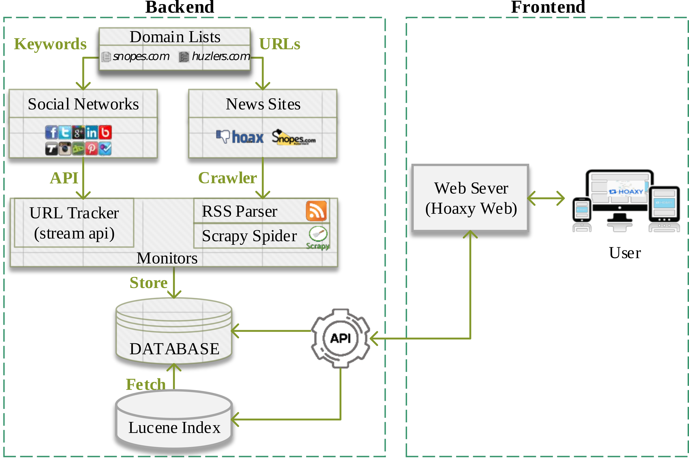

# System architecture of hoaxy.
The whole hoaxy system can be divided into two main part: frontend and 
backend, see figure .

You can download the [pdf](architecture.pdf) version to get better resolution.

Hoaxy frontend is a tool, intending for the public, to visualize the 
spreading of claim and fact checking by utilizing Hoaxy backend APIs. You
can visit [hoaxy](http://hoaxy.iuni.iu.edu) to see more details. 

The backend is the core part of hoaxy that does all heavy tasks. In this 
manual we focus on the backend part. 

# Working flow.
The working flow of hoaxy backend is shown as following.

1. Preparing process. Hoaxy need two domain lists as input, one is for
claim sites and the other one is for the fact checking. We call them domain 
sources.
2. Data collecting process. Hoaxy collects data from two realms: social
networks and news sites. 

  1. From social networks, e.g., twitter, Hoaxy lively track tweets sharing any URLs belonging to domain sources using twitter streaming API.
  2. From news sites, Hoaxy utilizes many web crawling technologies, e.g. RSS and scrapy, to fetch news URLs belonging to domain sources.
  3. Finally, for all collected URLs, Hoaxy fetches the HTML page and does content extract to formulate structured article data, e.g., title, meta, and body.
3. Data storage process. All collected data, including sites, tweets, URLs, HTML pages and articles are saved into a relational database.
4. Indexing and searching process. Hoaxy uses Lucene to provide fast indexing and searching feature.
5. API service process. By utilizing Lucene, Hoaxy could provide useful APIs for outside users.

During the data collecting process, there are two important hazards need to
be addressed: the duplicate content of URLs and HTML page content extraction.
The duplicate content of URLs hazard is the issue that several different URLs
could refer to the same resource. And the html page content extraction hazard
is the difficulty to get correct and clean article components, e.g., title
and body from a HTML page, due to the huge variance of HTML structure among 
different sites. For the content extraction issue, we don't implement our own parser,
instead we rely on a webparse service provide by [mercury](https://mercury.postlight.com/). 
We also tried another method provided by [python-goose](https://github.com/grangier/python-goose),
which didn't work very well for many cases.

For the duplicate content of URLs issue. We would like to find one canonical 
form URL to represent all the URL variants referring the same resource. 
By the term canonical URL, we mean that we could access the resource without 
redirection and without unnecessary GET parameters. For Hoaxy, 
the URLs we collected come from two sources: news sites and twitter. 
These collected from news site are mostly canonical. While these from 
twitter contain lots of variants, mostly caused by the following operation:

1. Adding unnecessary URL parameters. When using HTTP GET method, URLs are allowed to provide additional parameters. Some of them are necessary to locate the resource, while some of them are auxiliary. For example, we find lots of URLs using UTM parameters, e.g., `utm_medium=twitter`. UTM parameters are often used by Google Analytics to track the visit of URLs, e.g., `utm_medium=twitter` indicates that this URL is visited by twitter medium.
2. Using URL shorten service. URL shorten services is used to make a long URL shorter and easier to input and remember. But it also make us unable to recognize them before expanded the shortened URLs. 
3. Using snapshot service. Snapshot service provides ways to take a snapshot of a webpage and save the snapshot for future visiting. One intention of this service is to backup webpages and make their content always available even if the original pages are modified or deleted, e.g., service provided by [archive.is](http://archive.is/). Another philosophy from [donotlink](donotlink.it) is used to link questionable websites without improving their position in search engines. 
4. Duplicate domains. We noticed that some sites own multiple domains, e.g., `dcgazette.com` and `thedcgazette.com` are the same site. In most cases, one of these domains are primary domain and when you visit the alternate domain, it redirects you to the primary domain site, which means this case is similar like the shorten service. In our database, there are only three sites own multiple domains, which are very small amount of all. 

Base on these observations, we focus on the first two cases. And our URL canonicalization process goes as:

1. Send HTTP request (HEAD or GET) of the URL to resolve the redirection issue, the resolved URL is called expanded URL.
2. Remove all UTM parameters from the expanded URL, the URL after this operation is treated as canonical URL.

Note that it is almost impossible to determine whether an unknown parameter is necessary parameter for the URL. Here we only resolve the most common case for our database, the UTM parameters. And in the following discussion, when we mention URLs we always refer the canonical URLs.
